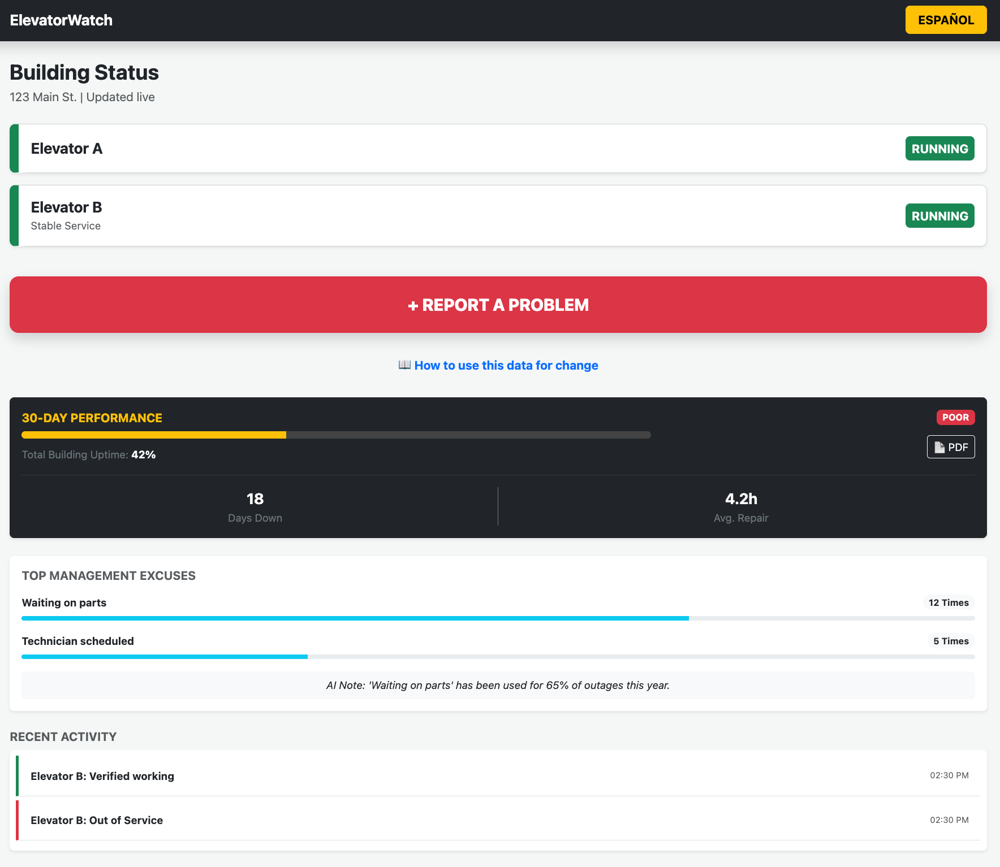

# 🛗 ElevatorWatch | Vigilancia de Elevadores

> ElevatorWatch is a resident-powered accountability tool designed to bridge the gap between building management claims and the lived reality of tenants in high-rise housing. By crowdsourcing elevator status and tracking maintenance excuses, the app builds an irrefutable record for housing advocacy.

## ✨ Key Features
- **Bilingual First**: Fully localized for Mexican Spanish, ensuring the app is accessible to the community it serves without the friction of "robotic" translation.
- **Accountability Dashboard**: Live calculation of "Building Uptime" and tracking of "Top Management Excuses" (e.g., "Waiting for Parts").
- **Resident Verification**: A crowdsourced verification model where residents log when a repair is actually completed, catching discrepancies in official logs.
- **Multimedia Proof**: Integrated support for voice reporting and photo/video uploads to provide timestamped visual evidence of failures.
- **Legal Playbook**: A "Resident Action Guide" modal that explains how to leverage collected data for 311 complaints and legal escalation.

---

## 🚀 User Story Walkthrough
To demonstrate the power of ElevatorWatch, follow this standard user journey:
1. **The Dashboard (Entry)**: Start in English. Notice the high-contrast, accessible cards. Toggle the ESPAÑOL button to see the idiomatic translation (e.g., "Elevador" vs "Ascensor").
2. **Reporting a Failure**: Resident A sees Elevator B is broken. They click + Report a Problem -> Select Elevator B -> Select Out of Service.
3. **Capturing Excuses**: The resident selects "Waiting on parts" from the management dropdown and attaches a photo of the "Out of Order" sign.
4. **Data Capture**: Upon submission, the "Days Down" counter increments, and the History Log updates with a 📸 icon, signaling that proof has been stored.
5. **Closing the Loop**: Hours later, Resident B sees the elevator moving. They click ✅ It's working now. The app logs the exact time of repair, exposing the duration of the outage.

---

## 📝 Project Reflection
### 1. What did you build?
I developed a mobile-responsive dashboard that serves as a "Single Source of Truth" for building residents. Unlike standard maintenance apps, this is an advocacy platform. It uses state-driven UI (Bootstrap 5.3) to track real-time outages and allows residents to generate "Proof of Neglect" reports through quantified metrics like Uptime % and recurring maintenance excuses.

### 2. What would you do with more time?
- **Automated Escalation**: Integrate with the NYC 311 Open Data API to automatically file formal complaints after a failure threshold is met.
- **Push Notification Engine**: Alert residents with mobility issues the moment an elevator goes down so they aren't stranded in the lobby or stairwell.
- **Geospatial Mapping**: Create a city-wide view to compare "Uptime Grades" across different buildings managed by the same company to expose systemic neglect.

### 3. How did AI help you?
AI acts as the analytical engine that validates resident experiences:
- **NLP Categorization**: Transcribing voice reports into actionable data (e.g., "it's shaking" becomes "Mechanical Safety Risk").
- **Computer Vision**: Analyzing uploaded photos of "Out of Service" signs to verify crowdsourced claims.
- **Pattern Recognition**: Analyzing management’s text-based excuses to identify when a company is using repetitive delay tactics to avoid fines.

---

## 🛠️ Tech Stack
- **Frontend**: HTML5, CSS3, JavaScript (ES6+)
- **Design Language**: Bootstrap 5.3 (Mobile-First, High Accessibility)
- **Localization**: Dynamic state-based translation (English/Mexican Spanish)
- **Icons**: Emoji-based (High compatibility, low latency)
